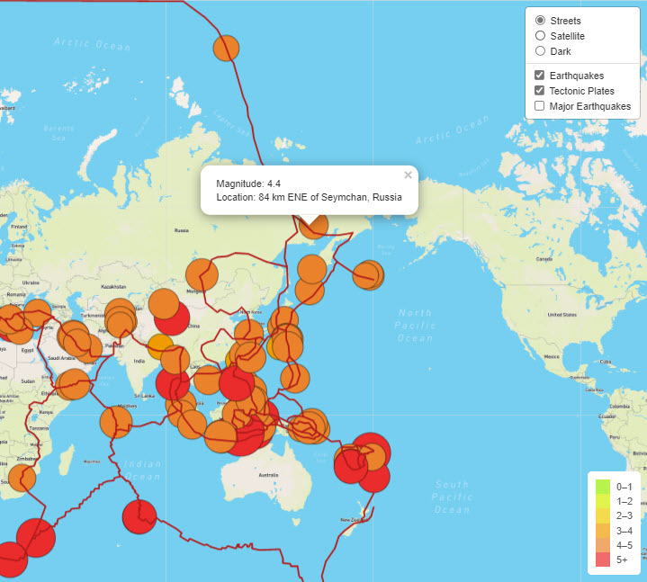
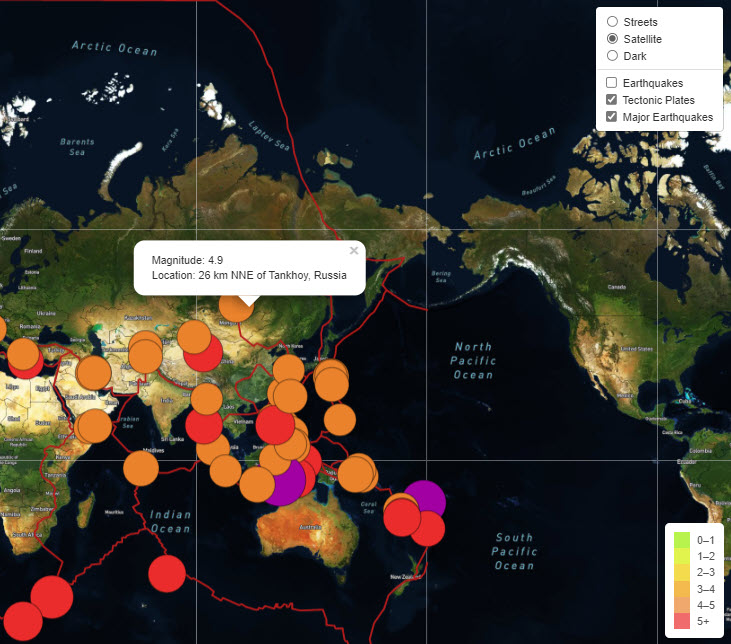
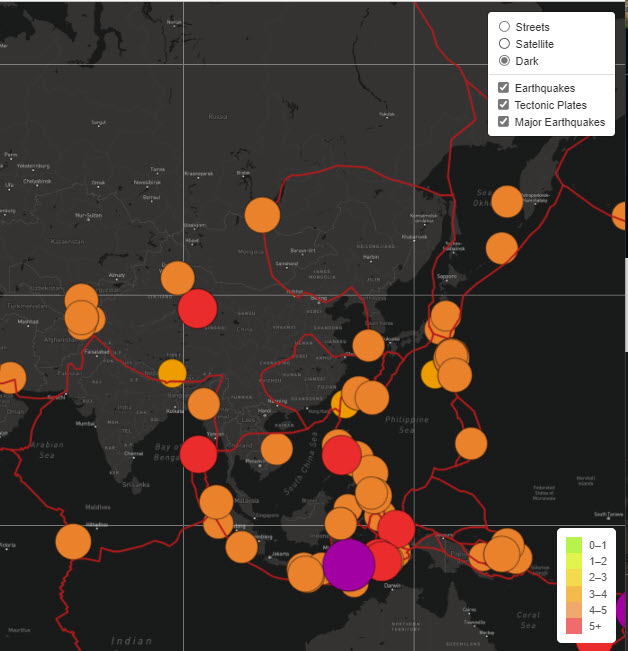

# Mapping Earthquakes

## Overview of the Project

As a data visualization specialist for Disaster Reporting Network, I have been tasked to build data visualizations with interactive features for earthquakes from around the world. Using GeoJSON data, the maps display live earthquake data from the USGS website. The maps include a legend and a panel to toggle between different base maps and layers.

**Base Maps**
- Streets
- Satellite
- Dark

**Layers**
- Earthquakes (all earthquakes)
- Tectonic Plates
- Major Earthquakes (>4.5 magnitude)

Each earthquake is displayed with a circle marker and a popup showing the magnitude and location of the earthquake. The tectonic plates are also displayed on the project.

## Resources

- Javascript
- Leaflet.js
- GeoJSON
- d3
- Mapbox
- HTML
- CSS

#### Deliverables

**Deliverable 1: Add Tectonic Plate Layer**

The challenge was based on work done previously in the module. In this deliverable tectonic plates were added as a second layer group and the tectonic plate data was added to the overlay object. The line color and width were also added to the overlay. The tectonic plate data is available to toggle on or off. Street base layer is visible.

***

**Deliverable 2: Add Major Earthquake Date**

All earthquakes in the past 7 days were previously retrieved under the "Earthquakes" overlay; however, in this deliverable we added an object to pull GeoJSON data from USGS for earthquakes greater than magnitude 4.5. Circle marker color was changed to purple for earthquakes > 6 magnitude, red for magnitudes > 5 and less than 6, and orange for any magnitude below 5. The option to toggle this overlay on or off was also added to the map. Satellite base layer is visible.

***

**Deliverable 3: Add an Additional Map**

The original code inluded maps for satellite streets and streets. In this deliverable we also added a dark layer to the map and have the option to toggle it on or off. Dark base layer is visible.

